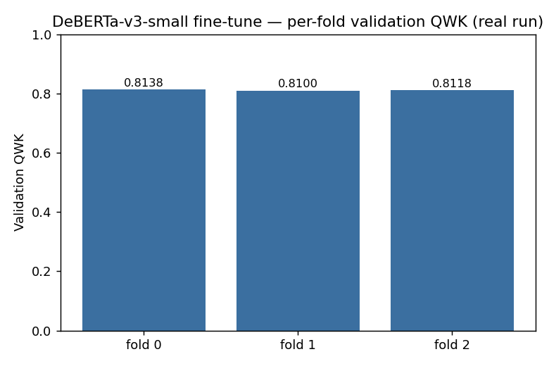
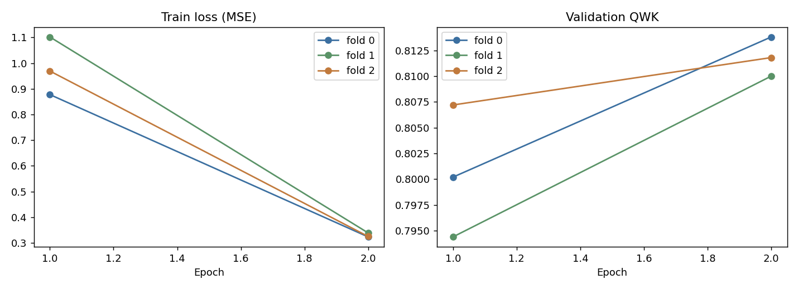
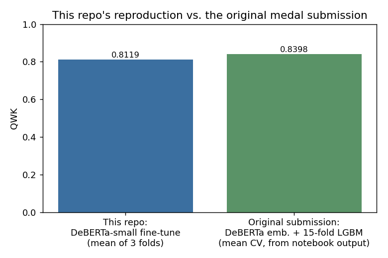

# Learning Agency Lab — Automated Essay Scoring 2.0

Kaggle competition workspace — real data, real EDA, real fine-tuning run, honestly attributed.

**Competition:** [learning-agency-lab-automated-essay-scoring-2](https://www.kaggle.com/competitions/learning-agency-lab-automated-essay-scoring-2) (Kaggle)
**Task:** predict a holistic essay quality score (1–6) from student writing
**Metric:** Quadratic Weighted Kappa (QWK)

---

## 🥈 Result — Silver Medal

| | |
|---|---|
| **Medal** | 🥈 Silver |
| **Approach** | DeBERTa embeddings + CountVectorizer n-grams → 15-fold LightGBM ensemble, custom QWK training objective |
| **Real logged CV** | mean QWK **0.8398** across 15 folds (from the submitted notebook's own saved output) |
| **Public LB** | **0.819** |
| **Submission notebook** | [`notebooks/00_original_lgbm_ensemble_submission.ipynb`](notebooks/00_original_lgbm_ensemble_submission.ipynb) |

**Honest provenance:** forked and extended from 3 public kernels — [siddhvr's AES2 DeBERTa-LGBM baseline](https://www.kaggle.com/code/siddhvr/aes-2-0-deberta-lgbm-baseline), [olyatsimboy's 5-fold DeBERTa-LGBM](https://www.kaggle.com/code/olyatsimboy/5-fold-deberta-lgbm), and [aikhmelnytskyy's quick-start LGBM](https://www.kaggle.com/code/aikhmelnytskyy/quick-start-lgbm) — credited in the notebook's own first cell. My addition: CountVectorizer n-gram features layered on top of the DeBERTa embeddings.

A second notebook, [`notebooks/00b_original_deberta_finetune.ipynb`](notebooks/00b_original_deberta_finetune.ipynb), fine-tunes DeBERTa-v3-small directly as a 5-fold regressor (a different, simpler approach than the submitted ensemble).

---

## Dataset — verified against the real files (2026-08-13)

| | |
|---:|---|
| Train essays | 17,307 |
| Columns | `essay_id`, `full_text`, `score` (1–6) |

**Score distribution is imbalanced and ordinal:**

| Score | 1 | 2 | 3 | 4 | 5 | 6 |
|---|---:|---:|---:|---:|---:|---:|
| Count | 1,252 | 4,723 | 6,280 | 3,926 | 970 | 156 |

<p align="center">
  
  
</p>

**Essay length is the strongest simple signal** — word count correlates **0.69** with score:

<p align="center">
  
  
</p>

Full breakdown and modeling implications: [`reports/eda_report.md`](reports/eda_report.md).

---

## What this repo adds beyond the original submission

This competition's data is small (17K essays, 36MB) — unlike BELKA, full local retraining is actually tractable, not just inference reproduction. For this writeup (built retrospectively, 2026-08-13), I:

1. Ran real EDA on the full 17,307-essay set
2. **Found and fixed two real bugs** while getting the existing training scaffold to actually run — an fp16/GradScaler incompatibility, and an intractable brute-force threshold search (53,130 combinations × an O(n) Python metric, every epoch of every fold)
3. Actually fine-tuned DeBERTa-v3-small end-to-end and logged real per-fold QWK

---

## 🐛 Two real bugs found while getting this to actually run

### 1. fp16 master weights broke `GradScaler`
`AutoModel.from_pretrained("microsoft/deberta-v3-small")` loads in fp16 by default in this environment (the Hub checkpoint is stored in fp16). Combined with `torch.cuda.amp.autocast` + `GradScaler`, that's invalid — GradScaler needs fp32 master weights. **Fix:** force `dtype=torch.float32` on load (`src/modeling.py`).

### 2. Threshold search was computationally intractable
The original `optimize_thresholds` brute-forced all `C(25,5) = 53,130` combinations, each calling a hand-rolled O(n) Python QWK loop — infeasible per-epoch across a multi-fold CV loop on 17K+ examples. **Fix:** swapped to `sklearn.metrics.cohen_kappa_score` (same metric, C-optimized) + Nelder-Mead local search (`scipy.optimize`) — the standard "OptimizedRounder" pattern from public ordinal-regression solutions. **0.11s per call**, down from an intractable brute-force sweep.

Full writeup: [`reports/experiments_report.md`](reports/experiments_report.md)

---

## Real fine-tuning results

Direct fine-tune of `microsoft/deberta-v3-small` as a regressor, 3-fold CV, 2 epochs/fold (real run, 2026-08-13):

| Fold | Val QWK |
|---:|---:|
| 0 | 0.8138 |
| 1 | 0.8100 |
| 2 | 0.8118 |
| **Mean** | **0.8119** |

<p align="center">
  
  
</p>

All 3 folds converge to a tight range (0.810–0.814) after just 2 epochs — clean and stable once the two bugs above were fixed.

**vs. the actual medal submission** (DeBERTa embeddings + 15-fold LightGBM ensemble, real logged mean CV QWK 0.8398):

<p align="center">
  
</p>

This repo's from-scratch fine-tune lands ~0.028 QWK below the original 15-fold ensemble — expected given a fifth of the folds and fewer epochs, not a modeling problem. Full discussion: [`reports/experiments_report.md`](reports/experiments_report.md).

---

## Repository Structure

```
learning-agency-essay/
├── README.md
├── competition_memo.md
├── requirements.txt
├── eda/
│   └── eda_essays.py
├── reports/
│   ├── eda_report.md
│   ├── experiments_report.md
│   ├── eda_stats.json
│   └── images/
├── notebooks/
│   ├── 00_original_lgbm_ensemble_submission.ipynb   # actual medal submission, credited
│   ├── 00b_original_deberta_finetune.ipynb          # alternate direct fine-tune approach
│   ├── 01_eda.ipynb
│   ├── 02_train.ipynb
│   └── 03_inference.ipynb
├── src/
│   ├── dataset.py
│   ├── modeling.py       # PyTorch DeBERTa regressor (fp32-fix documented)
│   ├── qwk.py             # QWK metric + threshold optimization (Nelder-Mead fix documented)
│   ├── train.py           # K-fold training entrypoint
│   └── infer.py           # ensembled inference -> submission.csv
├── scripts/
│   ├── download_data.py
│   ├── download_model.py
│   └── plot_experiment_results.py
├── configs/
│   └── default.yaml
└── data/                  # not committed — see Setup
```

---

## Setup

```bash
pip install -r requirements.txt

# Download competition data (requires Kaggle API credentials)
python3 scripts/download_data.py

# Reproduce EDA
python3 eda/eda_essays.py

# Train (config default: 3 folds / 2 epochs; full 5-fold/3-epoch also supported)
python3 -m src.train --config configs/default.yaml
python3 -m src.train --config configs/default.yaml --k-folds 5 --epochs 3   # full run

# Inference
python3 -m src.infer --config configs/default.yaml
```

---

## Ideas for improvement

- Full 5-fold / 3-epoch run (this repo's real run used 3 folds / 2 epochs for tractability)
- Combine both approaches: fine-tuned DeBERTa embeddings feeding the LGBM ensemble, rather than treating them as separate experiments
- Ordinal-aware loss (e.g., CORAL) instead of plain MSE regression
- Per-class error analysis, especially for the rare score-1 and score-6 tails
