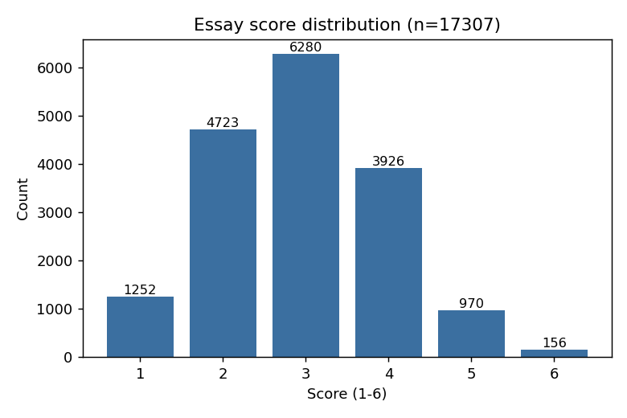
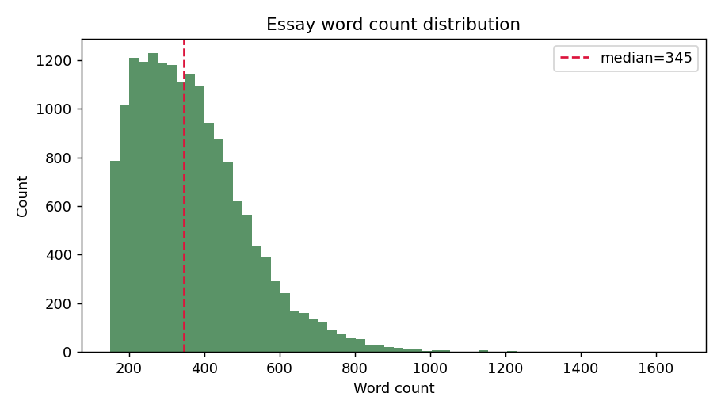
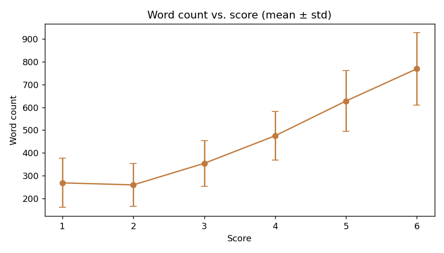
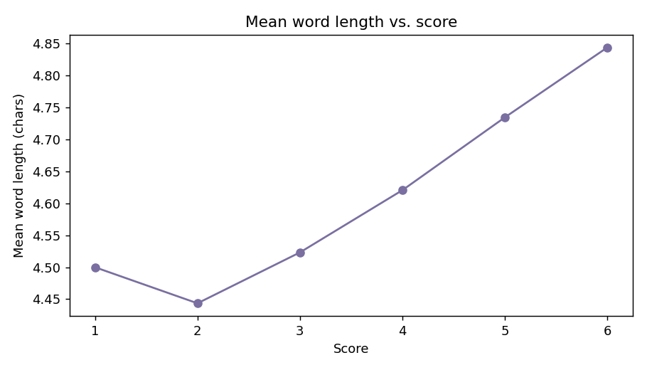

# EDA Report — Automated Essay Scoring 2.0
_Generated: 2026-08-13 by `eda/eda_essays.py`, run against the real competition `train.csv` (17,307 essays)._

## Score distribution — imbalanced and ordinal

| Score | Count | % |
|---:|---:|---:|
| 1 | 1,252 | 7.2% |
| 2 | 4,723 | 27.3% |
| 3 | 6,280 | 36.3% |
| 4 | 3,926 | 22.7% |
| 5 | 970 | 5.6% |
| 6 | 156 | 0.9% |

The middle scores (2–4) dominate (86.3% of essays); scores 1 and 6 are rare. This matters for modeling: a regression-then-round approach (as both original notebooks use) needs threshold calibration rather than naive rounding, since naive `round()` systematically under-predicts the rare extreme classes — exactly why both original notebooks include an explicit threshold-optimization step rather than just rounding continuous predictions.

## Essay length

| | Characters | Words | Sentences |
|---|---:|---:|---:|
| Mean | 2,072 | 368 | 20.9 |
| Median | 1,924 | 345 | 20 |
| Min | 712 | 150 | 1 |
| Max | 20,459 | 1,656 | 136 |

## Length correlates strongly with score

| Feature | Correlation with score |
|---|---:|
| Word count | **0.690** |
| Mean word length (vocabulary proxy) | 0.247 |

Word count is the single strongest simple signal in the dataset — longer essays score substantially higher on average. This is a well-known property of holistic essay scoring (more developed responses tend to score higher), and it's a useful sanity check: any model that ignores essay length entirely is discarding a strong, cheap signal. It's also a known risk — a model that leans too heavily on length as a proxy for quality can be gamed by padding, which is presumably part of why the competition uses a full transformer encoder (which can distinguish substantive length from repetition) rather than length-based features alone.

Vocabulary sophistication (mean word length) correlates more weakly (0.25) — essay length matters more than word complexity for this scoring rubric.

## Implications for modeling

1. **QWK, not accuracy or plain regression MSE, is the right target** — the ordinal, imbalanced score distribution means near-miss errors (5 vs. 6) should be penalized far less than large errors (1 vs. 6), which is exactly what QWK does and plain MSE doesn't directly optimize for.
2. **Threshold calibration on continuous predictions matters** — naive rounding of a regression output would systematically underserve the rare tail classes (score 1 and especially score 6, at 0.9% of the data).
3. **Word count is a strong, cheap baseline feature** — worth including as an explicit feature (as the LGBM notebook does via CountVectorizer) alongside transformer embeddings, not just relying on the transformer to rediscover it implicitly.
